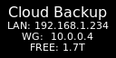

# 🖥 CloudKey Display Status (ck-splash)

This project uses the built-in CloudKey display to show basic status info by rendering a 128x64 PNG and pushing it to the screen using `ck-splash`.

## What It Displays

- Title: `Cloud Backup`
- LAN IP (interface `eth0`) — shows `down` if no IPv4
- WireGuard IP (interface `wg0`) — shows `down` if no IPv4
- Free space available on `/volume1/backup`

Example screenshot:



---

## Requirements

Install required tools:

```bash
apt update
apt install -y imagemagick
```

Verify `ck-splash` exists:

```bash
which ck-splash
```

---

## Install Script

Place the script on the CloudKey (recommended location):

```bash
nano /root/display.sh
```

Paste the script below, save, then make it executable:

```bash
chmod +x /root/display.sh
```

---

## Display Script

```bash
#!/usr/bin/env bash
set -euo pipefail

# ---- Config ----
MYFONT="DejaVu-Sans"
OUTPNG="/tmp/ck-status.png"

# ---- Helpers ----
get_ip() {
  local iface="$1"
  ip -4 addr show "$iface" 2>/dev/null | awk '/inet /{print $2}' | cut -d/ -f1 | head -n1
}

# ---- IPs ----
IP_ETH="$(get_ip eth0 || true)"
IP_ETH="${IP_ETH:-down}"

IP_WG="$(get_ip wg0 || true)"
# If wg0 has no IPv4, show "down"
IP_WG="${IP_WG:-down}"

# ---- Free space (available) on backup volume ----
FREE_BACKUP="$(df -h /volume1/backup 2>/dev/null | awk 'NR==2{print $4}')"
FREE_BACKUP="${FREE_BACKUP:-n/a}"

# ---- Render image ----
convert -size 128x64 xc:black "${OUTPNG}"

convert "${OUTPNG}" \
  -gravity north -fill white -font "${MYFONT}" -pointsize 16 \
  -annotate +0+4  "Cloud Backup" \
  -pointsize 11 \
  -annotate +0+21 "LAN: ${IP_ETH}" \
  -annotate +0+33 "WG:  ${IP_WG}" \
  -annotate +0+45 "FREE: ${FREE_BACKUP}" \
  "${OUTPNG}"

# ---- Push to CloudKey display ----
/sbin/ck-splash -s image -f "${OUTPNG}"
```

## Vertical Display Script

```bash

#!/usr/bin/env bash
set -euo pipefail

# ---- Config ----
MYFONT="DejaVu-Sans"
OUTPNG="/tmp/ck-status.png"
TMPPNG="/tmp/ck-status-portrait.png"

# ---- Helpers ----
get_ip() {
  local iface="$1"
  ip -4 addr show "$iface" 2>/dev/null | awk '/inet /{print $2}' | cut -d/ -f1 | head -n1
}

# 192.168.1.234 -> .1.234 (or 1.45)
format_ip() {
  local ip="$1"

  if [[ -z "$ip" || "$ip" == "down" ]]; then
    echo "down"
    return
  fi

  local o3 o4
  o3=$(echo "$ip" | awk -F. '{print $3}')
  o4=$(echo "$ip" | awk -F. '{print $4}')

  # If last octet is 3 digits, add leading dot for compact look
  if [[ ${#o4} -ge 3 ]]; then
    echo ".${o3}.${o4}"
  else
    echo "${o3}.${o4}"
  fi
}

# ---- IPs ----
IP_ETH_FULL="$(get_ip eth0 || true)"
IP_ETH_FULL="${IP_ETH_FULL:-down}"
IP_ETH="$(format_ip "$IP_ETH_FULL")"

IP_WG_FULL="$(get_ip wg0 || true)"
IP_WG_FULL="${IP_WG_FULL:-down}"
IP_WG="$(format_ip "$IP_WG_FULL")"

# ---- Free space ----
FREE_BACKUP="$(df -h /volume1/backup 2>/dev/null | awk 'NR==2{print $4}')"
FREE_BACKUP="${FREE_BACKUP:-n/a}"

# ---- Time (24h) ----
TIME_NOW="$(date +%H:%M)"

# ---- Create portrait canvas ----
convert -size 64x128 xc:black "${TMPPNG}"

# ---- Draw content (portrait) ----
convert "${TMPPNG}" \
  -fill white -font "${MYFONT}" \
  -gravity north \
  -pointsize 14 -annotate +0+4   "Cloud" \
  -annotate +0+20  "Backup" \
  -pointsize 10 \
  -annotate +0+42  "LAN ${IP_ETH}" \
  -annotate +0+55  "WG ${IP_WG}" \
  -pointsize 14 \
  -annotate +0+70  "FREE" \
  -pointsize 16 \
  -annotate +0+85  "${FREE_BACKUP}" \
  -pointsize 14 \
  -annotate +0+110 "${TIME_NOW}" \
  "${TMPPNG}"

# ---- Rotate for vertical mount ----
# If rotation is wrong direction, change -90 to 90
convert "${TMPPNG}" -rotate -90 -resize 128x64\! "${OUTPNG}"

# ---- Push to CloudKey display ----
/sbin/ck-splash -s image -f "${OUTPNG}"

---
```

## Run Manually

```bash
/root/display.sh
```

---

## Schedule with Cron (Every 5 Minutes)

Edit root crontab:

```bash
crontab -e
```

Add:

```cron
*/5 * * * * /root/display.sh >/dev/null 2>&1
```

This refreshes the display every 5 minutes.

---

## Disable / Clear the Display

Set screen to black:

```bash
ck-splash -s black
```

Restore UniFi splash screen:

```bash
ck-splash -s splash
```

---

## Notes

- The output image is written to `/tmp` (`tmpfs` on CloudKey), so it does not write to internal eMMC.
- If your LAN interface name is not `eth0`, update the script accordingly.
